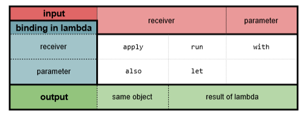
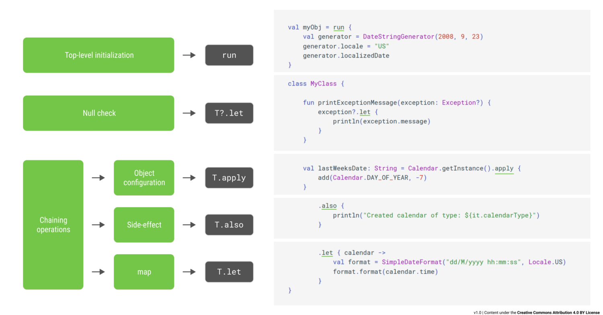

# 2. CONCEPTOS BÁSICOS

- En Kotlin, todos los tipos son clases. Todos los tipos son objetos, todos extienden de `Any` que sería equivalente al `Object` de Java. Por tanto todos los tipos se comportan igual en Kotlin, no como en Java. 

	Como desventaja, si quiero asignar un integer a una variable de tipo Long, no podré. No ocurren las conversiones automáticas que ocurrían entre tipos básicos en Java. Para esto disponemos la funciones de tipo `toLong()`, que nos permiten hacer esas conversiones entre tipos básicos.

- Las funciones son elementos de primer nivel. Igual que las variables, podemos definir funciones fuera de cualquier tipo de objeto o de clase. Incluso se pueden definir tipos del lenguaje que representan funciones.

## Clases:
- Hay dos tipos de clases muy diferenciadas: Objetos y Estructuras de Datos:
	- Objetos: Tienen información privada en forma de variable, y métodos públicos que nos permiten trabajar con esa información.
	- Estructuras de datos: Modelan información, estado y solemos poder acceder a esas variables de forma pública, ya sea mediante 
				setters o como en Kotlin, properties.

- Por defecto las clases en Kotlin son cerradas y para abrirlas tenemos que utilizar la palabra reservada `open`. Con el `open` podemos crear clases que hereden de la clase indicada como `open`. Por ejemplo:
			`open class Person(name: String, age: Int)` en vez de `class Person(name: String, age: Int)`

- Para crear una clase abstracta utilizamos la palabra reservada `abstract` en lugar de `open`. 

- Las clases abstractas y abiertas se diferencian en que, de una clase abstracta no se puede crear una instancia, de una abierta sí.

- Kotlin solo permite herencia simple, no herencia multiple, eso quiere decir que solo podemos heredar de una clase, no de varias a la vez.

- Ejemplo:
	```
	open class Person(name: String, age: Int)

	class Developer(name: String) : Person(name, 30) // Developer extiende de Person

	// llamando a los constructores para crear instancias
	Person("Frida", 30)
	Developer("Tom")
	```

## Properties:
- En Kotlin la forma de almacenar estado dentro de las clases, se realiza mediante propiedades. Estas propiedades vendrían a ser equivalente a un campo + un getter + un setter en Java.

- Es obligatorio asignar un valor inicial a las properties durante la construcción del objeto. Ejemplo:
	```
	open class Person(name: String, age: Int) {
		val name: String = name
		val age: Int = name
	}
	```
	Pero si el valor de la propertie lo vamos a igualar al parámetro del constructor, lo podemos indicar de la siguiente manera:

	```
	open class Person(val name: String, val age: Int)
	```
	* `val` si no vamos a modificar el valor de la property, en caso contrario la declariamos con `var`

- Tienen un getter y un setter por defecto que se puede sobreescribir. Cuando los sobreescribimos para acceder al valor de la property se utiliza la palabra reservada `field`. Por ejemplo:

	```
	open class Person(name: String, val age: Int) {
		var name = name
		get() = "Hello $field"
		set(value) {
			if(value != field) {
				field = value
			}
		}
	}
	```

- Properties sin backing field: Podemos tener properties sin backing field, esto lo hacemos dandole su valor solo a partir del getter. Esto nos puede servir para que el valor de esta propertie sea calculado cada vez que se pida. Lo podríamos hacer también con una función, pero la solución de property sin backing field es más avanzada:

	```
	class AppState {
    	val text = mutableStateOf("")
    	val buttonEnabled: Boolean
        	get() = text.value.isNotEmpty() 
	}
	```	

## Interfaces:
- Nos permiten definir un comportamiento que luego tendrán que implementar otros componentes. Con la salvedad de que en las interfaces de Kotlin podemos añadir código, aunque con ciertas restricciones. 

- En una interfaz podemos definir comportamiento pero en ningún caso podemos almacenar estado. Esto quiere decir que no podemos definir una property que necesite un backing field. Pero si que podemos definir properties que luego tengan que implementar las clases que extiendan esta interfaz, y usar esas properties en el código de la propia interfaz.

	```
	interface CanWalk {
		fun doStep()

		fun walk(steps: Int) {
			repeat(steps) { doStep() }
		}
	}

	class Dog : CanWalk {
		override fun doStep() {
			TODO("Not implemented yet")
		}
	}

	val dog = Dog()
	dog.walk(20)
	```	

## Data Classes:
- Son las que conforman una estructura de datos (vs las otras clases que son las conformaban un objeto). Estas nos permitirán trabajar con estructuras de datos de forma mucho más sencilla. Si añadimos la palabra reservada `data` delante de nuestra clase, añadirá funcionalidad extra, que nos va a permitir trabajar mejor con estos tipos de clases de datos.

- En Kotlin, igual que en Java, todos los objetos tienen su función `equals` que podemos sobreescribit en cualquier momento.

- El comparador equals de una clase, comprobará si los atributos de esa clase son iguales, y retornará `true` en ese caso, SI la class la hemos declarado con la palabra reservada `data`.

	```
	// en este caso la variable sonIguales tendrá valor false
	class Person(val name: String, val age: Int)

	val p1 = Person("Maik", 30)
	val p2 = Person("Maik", 30)

	val sonIguales = p1 == p2

	// en este caso la variable sonIguales tendrá valor true
	data class Person(val name: String, val age: Int)

	val p1 = Person("Maik", 30)
	val p2 = Person("Maik", 30)

	val sonIguales = p1 == p2
	```

- Las Data Classes tienen sobreescrito el método `toString`. Es más usable.
		
- Con el triple igual `===` se compara si los objetos son el mismo (si son la misma instancia). Esto sirve para clases y para data clases.

- En las Data Classes tenemos un método `copy`. Lo podemos utilizar para copiar una instancia y cambiar sólo uno de los valores:

	```
	val p3 = p2.copy(name = "Lina")
	```	
	
	La función `copy` la necesitamos porque si estamos trabajando con inmutabilidad, realmente no podríamos modificar un valor solo dentro de una estructura de datos, sino que la única manera sería hacer una copia igual, menos el valor que queremos cambiar.

- En las Data Classes también tenemos la desestructuración. Podemos partir el objeto Data Class en variables que se corresponden con los que recibe el constructor como argumento.

	```
	data class Person(val name: String, val age: Int)

	val p1 = Person("Maik", 30)

	val (a, b) = p1 // a = "Maik" y b = 30
	val (_, c) = p1 // _ si queremos omitir algún valor
	val (d) = p1	// podemos omitir valores desde el final: d = "Maik"

	```		

- En una Data Class no puede haber argumentos en el constructor que a su vez no sean properties. Esto porque sinó no puede calcular correctamente el `equals` o el `toString`.

## Colecciones:

- Las listas por defecto son inmutables. Si queremos crear una lista a partir de otra, lo que podemos hacer es una copia:

	```
	val list: List<Int> = listOf(1, 3, 78, 2) // creación de una lista de integers
	val emptyList: List<Int> = emptyList() // creación de una lista vacía

	val list2 = emptyList + 10 // list2 = [10]
	```

- Si queremos trabajar con listas mutables tenemos la clase: `MutableList`:

	```
	val list: MutableList<Int> = mutableListOf(3, 5, 98)
	list.add(54)
	```

- También disponemos de la clase `Set`. Son conjuntos de elementos no repetidos, por tanto si intentas añadir un elemento que ya existía, no se añade. 

	```
	val intSet = setOf(6,4,29)  
	```

Es importante tener en cuenta que si lo que contiene el set es una `Data Class` va a entender como elementos iguales aquellos que tengan los mismos valores en sus propiedades. Pero si lo que contiene el set son objetos, es decir `Class`, el equals no funciona de esta manera, y aunque no dos objetos tengan los mismos valores en sus propiedades, serán tratados como objetos diferentes ya que son instancias diferentes.

- También tenemos mapas: `Map`.  

	```
	val map = mapOf<Int, String>(
		1 to "first",
		2 to "second"
	)
	```

- A las colecciones le podemos aplicar operadores funcionales:
	
	```
	val list = listOf(
		Note("Title 1", "Desc1"),
		Note("Title 2", "Desc2"),
		Note("Title 3", "Desc3"),
		Note("Title 4", "Desc4"),
	)

	val result = list
		.filterNot { it.title.contains('2')}
		.sortedBy { it.title }
		.map { it.title }
	``` 

## Enums:

- Los `Enums` nos permiten definir un tipo de datos que van a tener un número predefinido de valores constantes.

	```
	enum class Shape {
		SQUARE, RECTANGLE, CIRCLE, OVAL, TRIANGLE
	}

	val myShape: Shape = Shape.OVAL

	```

- Todo enumerado tiene un valor ordinal que representa la posición del enumerado. 
- A partir de la enum class puedes sacar todos los posibles valores con la función `.values()`.
- También podemos sacar el tipo a partir de un string con la función `.valueOf()`.

	```
	val myShape: Shape = Shape.OVAL
	val myOrdinal = myShape.ordinal // myOrdinal = 3

	val allValues = Shape.values() // allValues es una Array con todos los shapes
	val squareFromString = Shape.valueOf("SQUARE") // tendremos SQUARE de tipo Shape almacenado en squareFromString (tipo Shape)

	```

- También podríamos añadir información extra a cada uno de los elementos de la enum class. Dichos valores son estáticos.

	```
	enum class Shape(val id: Int, val shapeName: String) {
		SQUARE(10, "square"), 
		RECTANGLE(20, "rectangle"), 
		CIRCLE(30, "circle"), 
		OVAL(40, "oval"), 
		TRIANGLE(50, "triangle")
	}

	val shape = Shape.valueOf("SQUARE")

	shape.id // 10
	shape.name // square 

	```

## Rangos:

- Los rangos permiten crear colecciones.

	```
	0..10 -> 0, 1, 2, 3, 4, 5, 6, 7, 8, 9, 10 // colección de Ints
	(0..10).map { "Item $it" } // colección de Strings
	(0..10 step 3) // progresión saltando de 3 en 3
	(10 downTo 0) // progresión inversa
	(0 until 10) // cerrado por la izquierda, el cero entra, abierto por la derecha, el 10 no entra
	```

- Hay rangos que son progresiones y rangos que no lo son. La diferencia es que los que son progresiones se tiene claro cuales son los pasos intermedios, a estos, le podemos aplicar operadores funcionales (a los otros no). Los que no son progresiones nos servirán simplemente para acotar. Los que son progresiones son: los enteros, los carácteres, y los long.
	
	```
	(0.0..1.0) // no es progresión
	(a..f) // si es progresión

	// ejemplo de uso de un rango que no es progresión
	val myDouble = 0.7f
	double in (0.0..1.0) // true
	```	


## Controles de Flujo:

- Algo que diferencia el flujo `if/else if/else` de Kotlin, es que se puede comportar como una expresión, por tanto, le podemos asignar el valor del if a una variable de resultado:

	```
	val result = if(condition) {
		"hello"
	} else {
		"goodbye"
	}

	```

- El operador `when` sería el equivalente al `switch` de java. Nos pertmite hacer varias bifurcacioens basadas en el valor de un elemento. Este oprador también puede actuar como una expresión si queremos.

	```
	val res = when(x) {
		1, 3, 5 -> "Hello"
		2 -> "Bye"
		else -> "end"
	}

	```	
También se puede utilizar sin argumento. En la condición se pueden utilizar llaves.
```
	when {
		x is Int -> {
			"Hello"
			count++
		}
		y.length > 5 -> x ="Bye"
		else -> x = end"
	}
	```


## Named Arguments y valores por defecto:

- Podemos utilizar valores por defecto en los constructores para tener varias sobrecargas del mismo. De esta manera podemos llamar al constructor omitiendo algunos parámetros.

	```
	data class Note(
		val title: String,
		val description: String = "",
		val type: Type = Type.PHOTO
	) {
		enum class Type { PHOTO, AUDIO }
	}

	Note("Hello") // descripción vacía y tipo PHOTO
	Note("Hello", "Description") // tipo PHOTO
	Note("Hello", "Description", Note.Type.AUDIO)

	```

- Ahora en caso de que queramos omitir el segundo parametro pero no el tercero, en vez de tener que poner el segundo a mano, podemos utilizar los named arguments.
	```
	Note(title = "Hello", type = Note.Type.AUDIO)
	```


## Lambdas:

- A parte de poder pasar funciones por argumento, pueden devolver funciones, pueden existir funciones sin estar dentro de una clase. Pero además: Las funciones se pueden representar como tipos dentro del propio lenguaje. Para representar una función como tipo lo haremos con la forma `(parámetro1, parámetro2) -> tipoDeRetorno`. Si no hay argumentos de entrada, igualmente si tienen que poner los paréntesis vacíos. Y si no hay resultado de salida, se utiliza `Unit`.

- Una función en Kotlin siempre devuelve algo, aun que sea `Unit`.

- El valor de retorno de una lambda es el valor de retorno de la última expresión, expresión que esté en la última linea.

	```
	val f: (Int, Int) -> Int = { x, y ->
		val z = x + y
		z
	}
	```
O mejor escrito:

```
	val f: (Int, Int) -> Int = { x, y -> x + y}
```

- Para llamar a una expresión de este tipo:
	```
	f(2, 3) // 5
	f.invoke(2, 3) // 5
	```

- La misma función se puede escribir de la siguiente forma, donde Kotlin infiere el tipo de salida.
	```
		val f = { x: Int, y: Int -> x + y}
	```

- Podemos pasar esta función por parámetro a otra función:

	```
	fun doOperation(x: Int, y: Int, op: (Int, Int) -> Int) = op(x, y)

	doOperation(2, 3, f) // 5
	doOperation(5, 7, {x, y -> x * y}) // 35
	doOperation(5, 7) {x, y -> x * y} // 35
	```
- Cuando el último parámetro de una función es una lambda, podemos sacarla de los paréntesis y poner el bloque de código detrás.

- Dentro de una función cuando utilizamos la palabra reservada `it` se va a referir al único argumento que tenga la función:
	```
	val f2: (Int) -> Int = {it * it}
	```


## Nullability:

- Kotlin no rechaza los nulos como tal, pero el compilador entiende que existen tipos que pueden tener un nulo, y por tanto, si nos encontramos con ese tipo, estamos obligados a comprobar la nulabilidad. De esta forma tenemos la ventaja de la simplicidad que da el trabajar con nulos, junto con la ventaja de que esos nulos estén controlados o no existan. Esto Kotlin lo hace teniendo tipos nulables y tipos no nulables.

- Para definir un tipo como nublable lo único que tenemos que hacer es añadir una interrogación detrás al tipo.
	```
	var x: Int? = 20
	x = null
	```

- Pero para hacer operaciones con X tendríamos que hacer la comprobación.
	```
	if(x != null) {
		x.toLong()
	}
	```
- O mejor escrito:
	```
	x?.toLong()
	```
- Para que en caso de que sea `null` devolver un 0:
	```
	x?.toLong() ?: 0L
	```

- Otra forma de saltarse la comprobación de nulabilidad es la doble exclamación. Con esta le dices que se salte la comprobación porque en teoría ya sabemos que ahí no va a haber un nulo.
	```
	x!!.toLong()
	```


## Extension Functions:

- Las funciones de extensión nos van a permitir extender la funcionalidad de una clase sin necesidad de modificar su código original. 
	```
	fun String.take3FirstChars() = this.take(3)

	val myStr = "hello"
	myStr.take3FirstChars()

	```	

- La palabra reservada `this` se refiere al objeto sobre el que estamos actuando. Esta se puede omitir y la función quedaría de la siguiente forma:
	```
	fun String.take3FirstChars() = take(3)
	```


## Scope Functions:

- Estas funciones nos permiten definir a partir de una variable, un ámbito, donde esa variable va a ser la máxima protagonista. Por ejemplo dado el siguiente código:
	```
	val strBuilder = StringBuilder()
	strBuilder.append("Hello")
	strBuilder.append(" ")
	strBuilder.append("World")
	val str = strBuilder.toString()
	```
	Se podría simplificar de la siguiente manera:

	```
	val strBuilder = StringBuilder()
	val res = with(strBuilder) {
		append("Hello")
		append(" ")
		append("World")
		toString()
	}
	```
	El `with` nos permite devolver el valor de la última linea, la última expresión.

- Incluso podríamos hacer la instanciación dentro del `with`.
	```
	val res = with(StringBuilder()) {
		append("Hello")
		append(" ")
		append("World")
		toString()
	}
	```

- Existe otra función muy parecida al `with` que es más recomendado utilizar cuando estamos devolviendo un valor. Es la función `run`, que es una función de extensión que se puede aplicar a cualquier objeto.
	```
	val res = StringBuilder().run {
		append("Hello")
		append(" ")
		append("World")
		toString()
	}
	```

- Si queremos devolver el objeto que hemos estado inicializando, y no uno nuevo, podríamos utilizar la palabra reservada `this`. Pero esto no es del todo correcto ya que tenemos otras funciones que hacen esto precisamente, como por ejemplo la función `apply`. Los dos bloques de código a continuación son equivalentes, pero el segundo es más correcto.
	```
	val myBuilder = StringBuilder().run {
		append("Hello")
		append(" ")
		append("World")
		this
	}
	```
	```
	val myBuilder = StringBuilder().apply {
		append("Hello")
		append(" ")
		append("World")
	}
	```

- La función let nos devuelve un objeto como `it` en caso de que este no sea `null`. Las dos lineas de código siguientes son equivalentes.
	```
	str?.take(3)?.reversed()?.let { println(it) }
	str?.take(3)?.reversed()?.let(::println)
	```

- También tenemos una función llamada `also` que nos permite ejecutar acciones laterales. Por ejemplo en el caso anterior:
	```
	str?.take(3)?.reversed()?.let(::myFun).also {
		println(it)
	}
	```
	También la podemos convertir en referencia:
	```
	str?.take(3)?.reversed()?.let(::myFun).also(::println)
	```






