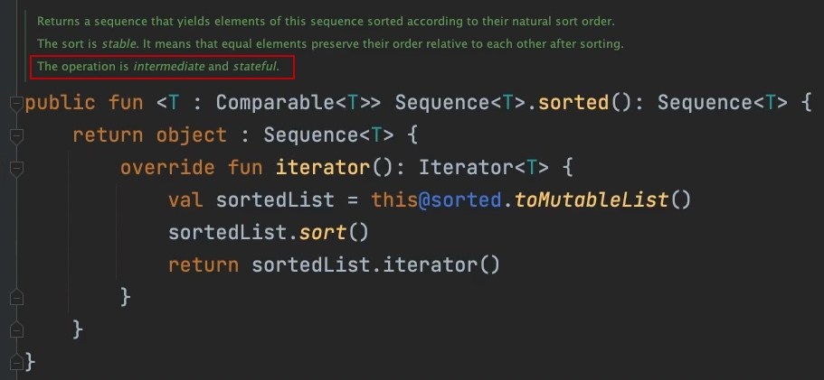

# 2. CORRUTINAS

- Las corrutinas nos permiten gestionar los hilos, y por otro lado gestionar la concurrencia: cuando ocurren las peticiones, como sincronizarlas, etc.

- Las corrutinas nos permiten escribir el código asíncrono pero de forma secuencial. Las peticiones que tengamos que requieran un callback, se pueden sustituir por peticiones que *parecen* secuenciales, y por tanto, el resultado de una linea lo podemos utilizar en la linea siguiente. (Solucionando el callback hell).

- Varias corrutinas se pueden ejecutar en un mismo hilo, los hilos se gestionan de manera eficiente para repartirse el trabajo. Mientras que los hilos concurrentes que se pueden ejecutar en una aplicación son limitados, la cantidad de corrutinas que se pueden utilizar en un mismo instante es muy grande.

- Las corrutinas están basadas en la idea de funciones suspendidas, estas son funciones que pueden suspender la ejecución de una corrutina en el punto donde se las llame, y una vez que esa función `suspend` ha terminado, informa a la corrutina para que pueda seguir ejecutandose en el punto donde lo dejó. Esa función `suspend` nos habrá devuelto un valor de retorno que podremos utilizar en las siguientes lineas.

- Las corrutinas son el lugar seguro donde las funciones `suspend` se pueden ejecutar sin llegar bloquear (por normal general) el hilo actual de ejecución.

	```
	data class User(val name: String, val friends: List<User>)

	class UserService {

		fun doLogin(user: String, pass: String, callback: (User) -> Unit) {
			// Server request
			callback(User("Maikela"))
		}

		fun requestCurrentFriends(user: User, callback: (List<User>) -> Unit) {
			// Server request
			callback(listOf(User("1"), User("2")))
		}

		fun requestSuggestedFriends(user: User, callback: (List<User>) -> Unit) {
			// Server request
			callback(listOf(User("3"), User("4")))
		}
	}

	// CALLBACK HELL EXAMPLE
	fun test() {
		val userService = UserService()
		println("Starting")
		userService.doLogin("user", "pass") { user ->
			userService.requestCurrentFriends(user) { currentFriends ->
				userService.requestSuggestedFriends(user) {
					val finalUser = user.copy(friends = currentFriends + suggestedFriends)
					println(finalUser)
				}
			}
		}
	}

	// PSEUDOCODE SOLUCIÓN AL CALLBACK HELL
	coroutine {
		val user = suspended { userService.doLogin("user", "pass") }
		val currentFriends = suspended { userService.requestCurrentFriends(user) }
		val finalUser = user.copy(friends = currentFriends)
		println(finalUser)
	}
	```

## Funciones Suspend:

- Funciones que nos permiten suspender el ciclo de ejecución de la corrutina, para que esta espere a que el resultado esté listo y poder utilizarlo en la siguiente linea. 

- Podemos convertir cualquier función en suspendida añadiendo delante la palabra reservada `suspend`.

- Una regla de las funciones suspendidas es que para que tenga sentido marcar una función como `suspend`, debe utilizar otra función suspend dentro.

- El ejemplo inicial con funciones suspend quedaría de la siguiente manera. (El interior de las funciones todavía es fake):
	```
	data class User(val name: String, val friends: List<User>)

	class UserService {

		suspend fun doLogin(user: String, pass: String): User {
			// Server request
			return User("Maikela")
		}

		suspend fun requestCurrentFriends(user: User): List<User> {
			// Server request
			return listOf(User("1"), User("2"))
		}

		suspend fun requestSuggestedFriends(user: User): List<User> {
			// Server request
			return listOf(User("3"), User("4"))
		}
	}

	fun test () {

		val userService = UserService()

		coroutine {
			println("Starting")
			val user = userService.doLogin("user", "pass") 
			val currentFriends = userService.requestCurrentFriends(user) 
			val finalUser = user.copy(friends = currentFriends)
			println(finalUser)
		}
	}
	```

## CoroutineContext y Dispatchers:

- El `CoroutineContext` es el que va a definir las condiciones en las que se ejecuta el bloque de código afectado por esa corrutina. Está formado por varios elementos: los dos más importantes son 
	- el `Dispatcher`: va a definir en qué hilo o conjunto de hilos se va a ejecutar y el código que afecta a ese contexto, y 
	- el `Job`: nos va a permitir controlar y realizar acciones sobre ese contexto, por ejemplo: esperar a que todas las corrutinas asociadas a ese job acaben, o cancelar todas esas corrutinas.

- La función `withContext` nos permite modificar el context de ejecución a partir del punto en el que se ejecute. Todo lo que añadamos a este contexto, sobreescribirá al contexto principal de la corrutina.

- En el ejemplo siguiente, tenemos una corrutina a la que le estamos diciendo que se ejecute en el hilo principal. Pero las funciones que se ejecutan son suspend, y utilizan `withContext` para cambiar de hilo.
	```
	data class User(val name: String, val friends: List<User>)

	class UserService {

		suspend fun doLogin(user: String, pass: String): User = withContext(Dispatchers.IO) {
			// Server request
			User("Maikela")
		}

		suspend fun requestCurrentFriends(user: User): List<User> = withContext(Dispatchers.IO) {
			// Server request
			listOf(User("1"), User("2"))
		}

		suspend fun requestSuggestedFriends(user: User) List<User> = withContext(Dispatchers.IO) {
			// Server request
			listOf(User("3"), User("4"))
		}
	}

	fun test () {

		val userService = UserService()

		coroutine(Dispatchers.Main) {
			println("Starting")
			val user = userService.doLogin("user", "pass") 
			val currentFriends = userService.requestCurrentFriends(user) 
			val finalUser = user.copy(friends = currentFriends)
			println(finalUser)
		}
	}	
	```

- Dispones de diferentes `Dispatchers` para indicar los hilos de ejecución: 
	- `Default`: Se utilizará muchas veces por defecto si no indicamos nada. Normalmente para operaciones que requieran un uso intensivo de la CPU. Algoritmos, tratamiento de listas muy grandes, etc. Va a utilizar tantos hilos como cores tenga la CPU de nuestro dispositivo.
	- `IO`: Cuando nos conectamos a otro sistema, y podemos quedarnos bloqueados esperando a que responda, pero no estamos empleando la CPU para nada. Acceso a base de datos, ficheros, peticiones a sensores, etc. Utiliza 64 hilos, o en caso de que la CPU del dispositivo tenga más cores que 64, utilizaría tantos hilos como cores del dispositivo.
	- `Main`: Hilo principal de las aplicaciones que utilizan UI.
	- `Uncofined`: Se usaba antes para testing pero ya casi no se utiliza. Lo que hace es que cuando vuelve de una petición, no necesariamente vuelve al hilo original de la corrutina sino que alomejor se queda en el hilo que la llamó. De esta forma no hay saltos entre hilos, ni entre dispatchers. 


## Builders y Jobs:

(dependencias -> implementation("org.jetbrains.kotlinx:kotlinx-coroutines-core-jvm:1.6.3"))

- El `Builder` es el que nos va a permitir crear una corrutina para luego poder llamar a funciones suspend dentro de ella. Existen distintos tipos:
	- `runBlocking`: Bloquea el hilo de ejecución hasta que el código de dentro del `runBlocking` se haya ejecutado.
	- `launch`: Es el más importante. No nos va a bloquear el hilo principal (si utilizamos el `dispatcher` adecuado). Para llamar a este `Builder` necesitaremos un `Scope`.
		```		
		fun test () {

			val userService = UserService()

			val job = GlobalScope.launch(Dispatchers.Main) {
				println("Starting")
				val user = userService.doLogin("user", "pass") 
				val currentFriends = userService.requestCurrentFriends(user) 
				val finalUser = user.copy(friends = currentFriends)
				println(finalUser)
			}
		}	
		```
	- `async`: Este constructor no puede vivir por si mismo, tiene que ser llamado dentro de otro constructor, habitualmente `launch`. Cuando generamos una corrutina con este builder, lo que ocurre es que en ese momento, la ejecución no se queda detenida esperando, sino que automáticamente pasa a ejecutarse la linea siguiente. Este `async` devuelve un job especial de tipo `Deferred` que tiene una función `await()`y es cuando llamemos a esta función que nos vamos a quedar suspendidos esperando el resultado.

	En el ejemplo siguiente las funciones que llaman `currentFriends` y `suggestedFriends` se ejecutan secuencialmente, pero una no necesita el resultado de la otra, por tanto podríamos hacer que se ejecuten en paralelo.
		```		
		fun test () {

			val userService = UserService()

			val job = GlobalScope.launch(Dispatchers.Main) {
				println("Starting")
				val user = userService.doLogin("user", "pass") 
				val currentFriends = userService.requestCurrentFriends(user)
				val suggestedFriends = userService.requestSuggestedFriends(user) 
				val finalUser = user.copy(friends = currentFriends + suggestedFriends)
				println(finalUser)
			}
		}	
		```
	Podemos paralelizar la ejecución de las dos funciones de la siguiente manera:
		```		
		fun test () {

			val userService = UserService()

			val job = GlobalScope.launch(Dispatchers.Main) {
				println("Starting")
				val user = userService.doLogin("user", "pass") 
				val currentFriends = async { userService.requestCurrentFriends(user) } // currentFriends: Deferred<List<User>>
				val suggestedFriends = async { userService.requestSuggestedFriends(user) } // suggestedFriends: Deferred<List<User>>
				val finalUser = user.copy(friends = currentFriends.await() + suggestedFriends.await())
				println(finalUser)
			}
		}	
		```

- Las funciones `launch` siempre devuelven un `Job` con el que podremos hacer diferentes operaciones:
	- `job.join()`: Permite hacer que otra corrutina espere a que esta acabe (la del job) antes de seguir avanzando en la ejecución del código.
	- `job.cancel()`: Cancelar todas las corrutinas asociadas a este job, de tal forma que su código no siga ejecutándose.


## Scopes:

- Cuando ejecutamos una corrutina es importante definir en qué ámbito queremos que se ejecute y en qué ámbito aplica, de tal forma que no se exceda de esos límites de ejecución. Por ejemplo, si una petición que estamos haciendo en la aplicación, solo tiene sentido mientras una pantalla está abierta. Si el usuario cambia de pantalla, y la ejecución termina e intenta actualizar unos componentes que ya no existen, es posible que se lance una excepción.

- `Global Scope`: va a estar activo durante todo el tiempo de vida de la aplicación.

- Para crear un `scope` lo podemos hacer de la siguiente manera, implementado la interfaz CoroutineScope: 
		```		
		fun test () {

			val coroutineScope = object: CoroutineScope {

				val job = Job()

				override val coroutineContext: CoroutineContext
					get() = Dispatchers.Main + Job
			}

			val userService = UserService()

			coroutineScope.launch {
				println("Starting")
				val user = userService.doLogin("user", "pass") 
				val currentFriends = async { userService.requestCurrentFriends(user) } // currentFriends: Deferred<List<User>>
				val suggestedFriends = async { userService.requestSuggestedFriends(user) } // suggestedFriends: Deferred<List<User>>
				val finalUser = user.copy(friends = currentFriends.await() + suggestedFriends.await())
				println(finalUser)
			}

			coroutineScope.job.cancel()
		}	
		```

- Deberíamos llamar a `coroutineScope.job.cancel()` cuando el ciclo de vida del componente asociado a este scope, finalize.

- También podríamos hacer que una clase que se encarga de otro tipo de cosas, extienda de CoroutineScope y también gestione toda esa parte, por ejemplo una Activity.

- Cuando estamos trabajando con UI, es más interesante utilizar `SupervisorJob` en vez de `Job`. El `Job` se cancela cuando alguna de las operaciones de la corrutina falla, y por tanto, perdemos el resto de operaciones que se pueden estar ejecutando (todos los `jobs` hijos, se cancelan). En cambio en los `SupervisorJob` esto no ocurre, y si una operación falla no quiere decir que todas las demás se cancelen.
		```		
		fun test () {
			val coroutineScope = object: CoroutineScope {

				val job = SupervisorJob()

				override val coroutineContext: CoroutineContext
					get() = Dispatchers.Main + Job
			}

			val userService = UserService()

			coroutineScope.launch {
				println("Starting")
				val user = userService.doLogin("user", "pass") 
				val currentFriends = async { userService.requestCurrentFriends(user) } // currentFriends: Deferred<List<User>>
				val suggestedFriends = async { userService.requestSuggestedFriends(user) } // suggestedFriends: Deferred<List<User>>
				val finalUser = user.copy(friends = currentFriends.await() + suggestedFriends.await())
				println(finalUser)
			}

			coroutineScope.job.cancel()
		}	
		```

- Si queremos un `CoroutineScope` que trabaje sobre el hilo principal, ya existe un objeto que podemos utilizar: `MainScope`. Este objeto está implementado con un `SupervisorJob` y un `Dispatchers.Main`:
		```		
		fun test () {
			val coroutineScope = MainScope()

			val userService = UserService()

			coroutineScope.launch {
				println("Starting")
				val user = userService.doLogin("user", "pass") 
				val currentFriends = async { userService.requestCurrentFriends(user) } // currentFriends: Deferred<List<User>>
				val suggestedFriends = async { userService.requestSuggestedFriends(user) } // suggestedFriends: Deferred<List<User>>
				val finalUser = user.copy(friends = currentFriends.await() + suggestedFriends.await())
				println(finalUser)
			}

			coroutineScope.coroutineContext.job.cancel()
		}	
		```


## Secuencias:

- Las secuencias se diferencian del resto de colecciones en que son un tipo de colecciones `lazy`. Esto quiere decir que en vez de contener una serie de objetos ya disponibles desde el principio, estos objectos no se calculan hasta el momento en que realmente se necesitan. Los objetos dentro de la colección se van creando según se necesitan. 

- Una ventaja de esta característica, es que las secuencias pueden ser infinitas. 

- Otra de las ventajas es que nos permite evitar pasos intermedios. A diferencia del resto de colecciones, cuando una secuencia realiza varias operaciones (map, filter, etc.), estas se aplican en cadena, en los objectos de uno en uno, en vez de crear una nueva colección intermedia entre cada una de las operaciones.

- Diferentes maneras de crear una secuencia:
	```
	// sequenceOf builder
	val sequence = sequenceOf("one", "two", "three")

	// desde una lista
	val list = listOf("one", "two", "three")
	val sequenceFromList = list.asSequence()

	// a partir de una semilla y una función
	val sequenceFromSeed = generateSequence(2) { it * 2 }

	// por ejemplo para coger las potencias de 2 menores que 10000
	generateSequence(2) { it * 2 }
		.takeWhile { it < 10_000 }
		.toList()

	// bloque sequence
	sequence {
		yield(3)
		yieldAll(listOf(4, 20, 25))
		yieldAll(generateSequence(2) { it * 2 }.takeWhile { it < 10_000 })
	}.toList()
	```	

- Tenemos dos tipos de operaciones en función del estado: 
	- `Stateless`: Operaciones que no necesitan estado intermedio para calcular sus valores, o necesitan una cantidad muy pequeña y constante. Ej: Map, Filter, Take, Drop...
	- `Statefull`: Operaciones que requieren una gran cantidad de memoria para procesarse. Normalmente proporcional al numero de elementos de la secuencia. Ej: Sorted, Distinct, Chunked... 


- Otra clasificación de las operaciones es un función de si generan una nueva secuencia o pueden calcular el resultado directamente:
	- `Intermediate`: Al aplicarla devuelve como resultado una nueva secuencia. Esta nueva secuencia no necesita calcular aún los valores.
	- `Terminal`: Estas ya necesitan todos los valores de la secuencia y por tanto van a tener que iterar sobre todos los elementos de la secuencia. Ej: toList, sum... 

- Las operaciones `terminales` TODAS son `Statefull`. Van a generar una nueva colección pasando por todos los elementos de la lista.

- Para saber de qué tipo es la operación, podemos hacer `command + click` para entrar en la implementación y en la definición de lo indica: 
	


## Flows:

- Los `Flows` en Kotlin, son una funcionalidad que nos provee la librería de corrutinas, para implementar la programación reactiva. La idea de la programación reactiva es que cuando un valor cambia, en vez de tener que ir a buscar esa actualización de la información, suscribirse a un componente que nos va a informar de forma automática.

- La programación reactiva está montada sobre el patrón `Observer`. El patrón observer consite en tener una clase, que podemos llamar el `observable`, que va a estar emitiendo valores y que permite a `observers` suscribirse, para ir obteniendo actualizaciones de esos valores.

- Los `Flows` son secuencias asíncronas. Igual que las secuencias, solo que los elementos no se calculan de manera síncrona. Los valores del flow pueden ser peticiones a un servidor o BD y podemos quedarnos suspendidos esperando a esos valores. Lo que quiere decir que las operaciones terminales no reciben todos los valores a la vez, sino que también se quedarán suspendidas esperando a que se reciban nuevos valores.

- Los `Flows` como las secuencias, son `lazy`. Lo que quiere decir que hasta que no haya alguien que requiera los valores del `flow`, las operaciones que hay en ellos no se ejecutan. (En los `flows` por defecto). Por esto se les llama `cold streams`.

- Por defecto, si otro elemento se conecta al `flow`, este empieza a emitir los valores desde el principio, desde el primer valor del flujo. 

- Los `Flows` son secuenciales. Esto quiere decir que si por ejemplo un `flow` va a generar X elementos y cada uno de ellos realiza una operación pesada o que tarda mucho tiempo, se van a ejecutar unos detrás de otros y hasta que el anterior no acabe, no va a empezar el siguiente.

- Existen tres formas de crear `flows`:
	- `val result = flowOf(1, 2, 3, 4)`
	- `val result = listOf(1, 2, 3, 4).asFlow()`
	- ```
		val res = flow {
			emit(1)
			emit(2)
		}
	```


